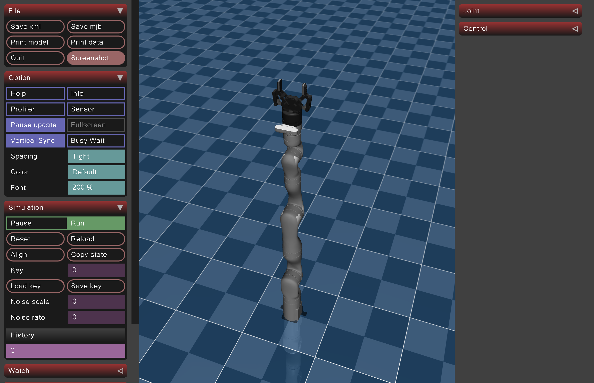
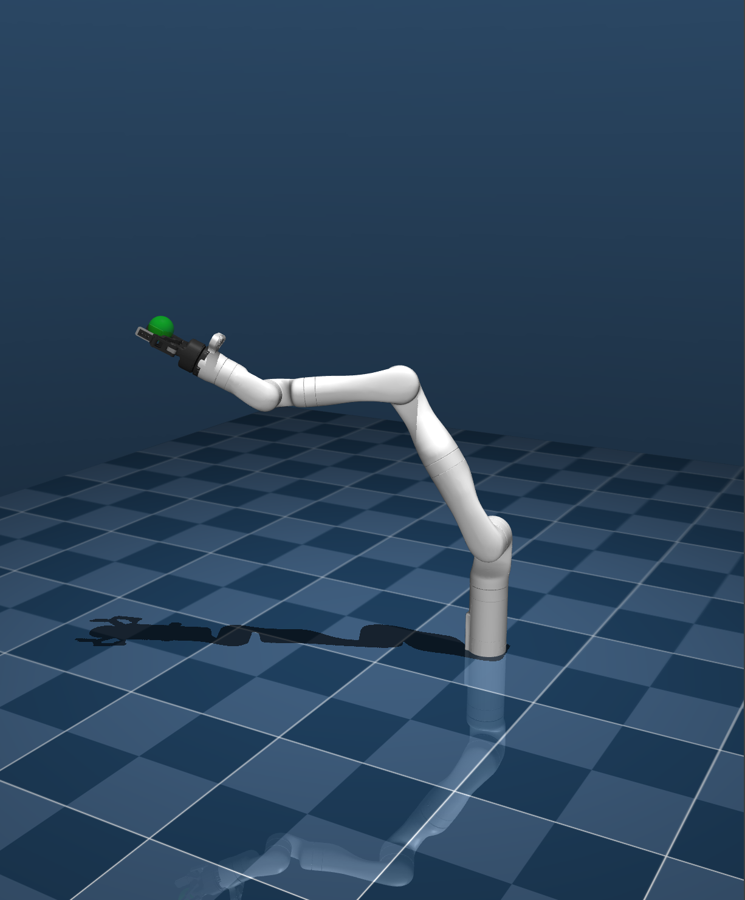
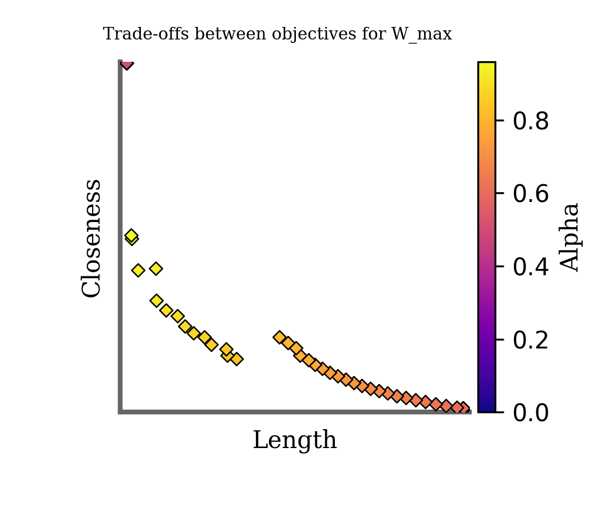

# Motion Planning for Kinova Gen3 in Mujuco
Authors: Connor Mattson, Zohre Karimi, Atharv Belsare

## TL;DR
Just run this:
```
pip install -r requirements.txt
python -m src.examples.pareto_search --cost-mode sum  # Weighted Sum
python -m src.examples.pareto_search --cost-mode max  # Weighted Maximum
```

## Requirements
Python 3.10
OS: Linux or MacOS. The code has not been tested for Windows.

**MacOS:**
If you are running this code on Mac, you will likely need to run each of the lines of code in this file with the special alias "mjpython" instead of "python"

## Installation

First, install mujuco if you haven't yet.
```
pip install -r requirements.txt
```

### Test Loading Robot Model + Gripper

Check that the robot model is loading correctly by running the following command.

```
python -m src.examples.gen3
```

You should see a mujoco model that looks like this:


If you get an error while running this, it is likely that your mujoco is not correctly installed, check [https://github.com/google-deepmind/mujoco_menagerie?tab=readme-ov-file#prerequisites] for more.

### Test Simulation, Gravity Compensation

To set the robot to a "home" position and test forward simulation with velocity control, run the following command

```
python -m src.examples.init_home
```

you should see the robot controlling the joints to hold perfectly still (gravity compensation).

### Test Velocity Control
As a robotics researcher, we'd really like to see the robot move. Let's make sure we can make it move with the following test.

```
python -m src.examples.test_vel_ctrl
```

<!-- ## Sample-based Motion Planning - RRT

[//]: # (Test naive RRT to go to a couple of joint positions)

[//]: # (```)

[//]: # (python -m src.examples.working_motion_demo)

[//]: # (```)

[//]: # (You will see the robot moving around as it navigates to some nearby joint states.)

Test RRT to go to a rendered goal position in EE space
```
python -m src.examples.rrt_demo
```
You will see a rendered green sphere that the robot is trying to move to, and the robot will plan a path to the sphere using RRT. See rendering below.
 -->

## Cost-based Motion Planning
In order to instantiate multiple objectives, we need to represent the moiton planning problem as the minimization of a cost function.

### Unconstrained Motion Planning
A simple example of weighted planning can be ran with
```
python -m src.examples.unconstrained_optim
```

### Constraint-based MP
To test constraint-based optimization that encodes velocity, accel., and goals as constraints, rather than cost features.
```
python -m src.examples.constrained_optim
```

### Pareto Line Search
You can sweep over the different combinations of weights to trade off between safety and path length with the following command
```
python -m src.examples.pareto_search
```

To use a weighted maximization (rather than a weighted sum), modify the command line arguments
```
python -m src.examples.pareto_search --cost-mode max
```

For help with this CLI,
```
python -m src.examples.pareto_search --help
```

### Pareto Front Visualization

To visualize the trade-off between trajectory length and obstacle avoidance:

#### Step 1: Generate CSV Results

Run the Pareto search and save results:
```
python -m src.examples.pareto_search --cost-mode sum --csv-file <PATH_TO_REPO>/src/pareto_data_and_results/tradeoff_data.csv
```

This creates a file at:
```
<PATH_TO_REPO>src/pareto_data_and_results/tradeoff_data.csv
```

#### Step 2: Plot the Pareto Front

Visualize the results with:
```
python -m src.visualization.plot_pareto_front \
    --input_csv <PATH_TO_REPO>/src/pareto_data_and_results/tradeoff_data.csv \
    --output_folder <PATH_TO_REPO>/src/pareto_data_and_results \
    --cost_mode sum
```

Optional arguments:
```
--output_filename pareto_front_sum.png
```

#### Plot Details

- **X-axis**: Trajectory Length Cost  
- **Y-axis**: Obstacle Closeness Cost  
- **Color**: Alpha (trade-off weight from 0 to 1)

Example:



